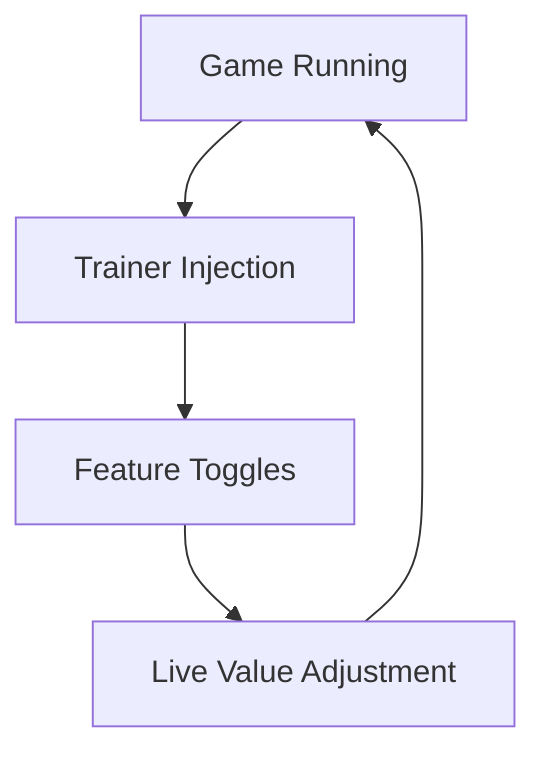

# Aion 2 Trainer 

In **Aion 2**, the sky remembers everything.
The beat of wings. The clash of steel. The long ascent from novice to legend.

But even legends grow weary of repetition.

The **Aion 2 Trainer** is a quiet instrument of control — not a hammer, but a tuning fork. It lets you explore systems, test limits, and soften friction while preserving the grandeur of a world built for flight, conflict, and myth.

Used wisely, it does not diminish the journey.
It clarifies it.

---

## Overview 🪽

Designed for **Aion 2**, this trainer is a PC-side utility that modifies selected gameplay values in real time.

Its purpose is not domination — but *adjustment*.

With it, players can:

* Experiment with movement and combat pacing
* Reduce grind-heavy pressure
* Practice mechanics in isolation
* Explore the world more freely

Always with control. Always reversible.

---

## Core Trainer Features ⚙️

The Aion 2 Trainer is structured around restraint. Every option exists to *support* play, not replace it.

### 🛡️ Character & Survival

Because mastery begins with breathing room.

* God Mode / Infinite HP
* Unlimited Mana / Energy
* Stamina Freeze
* No Fall Damage (flight-safe)

Ideal for:

* Exploration
* Learning class mechanics
* Long farming sessions

---

### ⚔️ Combat Modifiers

Power, applied surgically.

* Damage Multiplier
* One-Hit Kill toggle
* Cooldown Reduction
* Skill Resource Control

Perfect for:

* Rotation testing
* Build experimentation
* PvE encounter practice

> [!NOTE]
> Combat modifiers are best used outside competitive or shared environments.

---

### 🪽 Movement & Flight

Freedom, uninterrupted.

* Flight Time Freeze
* Movement Speed Control
* Gravity Adjustment
* Jump Height Modifier

The sky opens wider — without breaking immersion.

---

### 📈 Progression & Farming

Less repetition, more intention.

* XP Multiplier
* Drop Rate Boost
* Currency Gain Control
* Skill Level Adjustments

Use sparingly — the long arc of progression still matters.

---

## Why Use a Trainer in Aion 2? 🌌

Because MMORPGs are vast — and not every moment needs friction.

**Creative advantages**

* Learn faster, fail safer
* Explore without pressure
* Understand systems deeply
* Practice without penalty

**Technical strengths**

* Real-time toggles
* Hotkey-driven control
* Clean injection method
* Minimal performance impact

This trainer is a lens — not a shortcut.

---

## Typical Usage Flow 🔧

1. Launch Aion 2
2. Enter a safe or private environment
3. Run Aion 2 Trainer as administrator
4. Enable desired features via hotkeys
5. Adjust values live during play

Everything responds instantly — like a breath held, then released.

---

## Trainer Logic Loop 🧠

A closed loop of choice — always under your hand.

---

## Frequently Asked Questions ❓

**Is Aion 2 Trainer safe to use?**
Only in offline or private testing contexts.

**Will it affect my save data?**
Extreme values can — moderation is key.

**Can I disable features anytime?**
Yes. All options are live and reversible.

**Is this meant for PvP?**
No. Never use trainers in PvP or public servers.

**Is it useful for beginners?**
Yes — especially for learning classes and systems.

> [!IMPORTANT]
> Back up profiles or test on secondary characters when experimenting.

---

## Final Thoughts 🌄

Aion 2 is built on ascent — of wings, of power, of identity.

The **Aion 2 Trainer** does not steal that ascent.
It removes unnecessary weight from the climb.

Use it to learn.
Use it to explore.
Use it when curiosity grows louder than grind.

The sky is still vast.
The war still matters.
You simply choose how heavy your armor feels.

---
